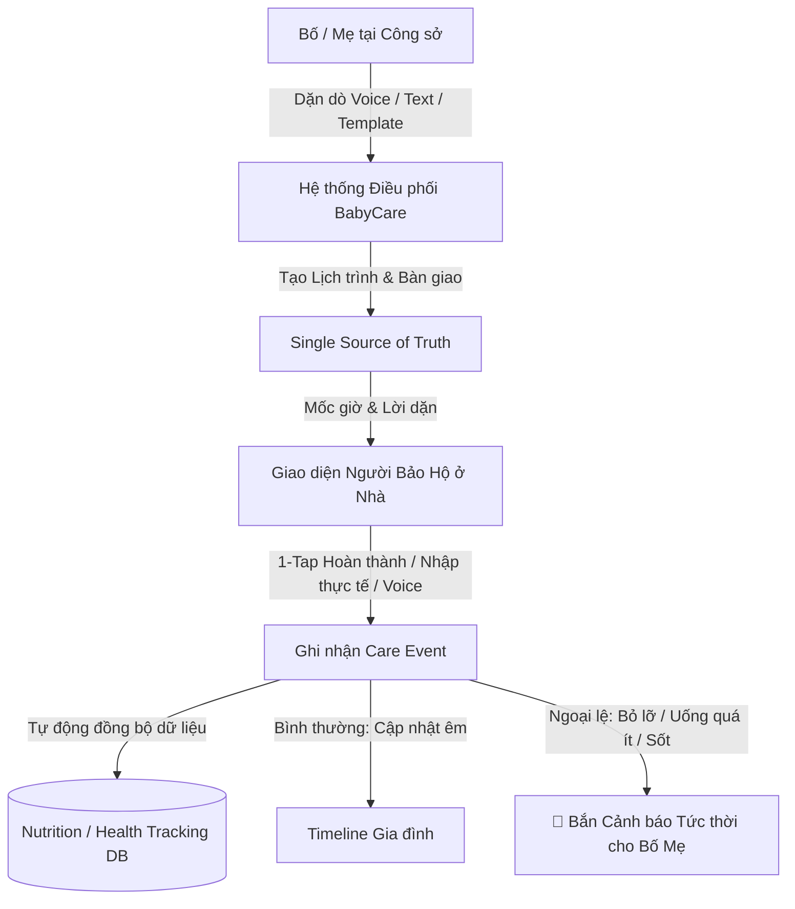
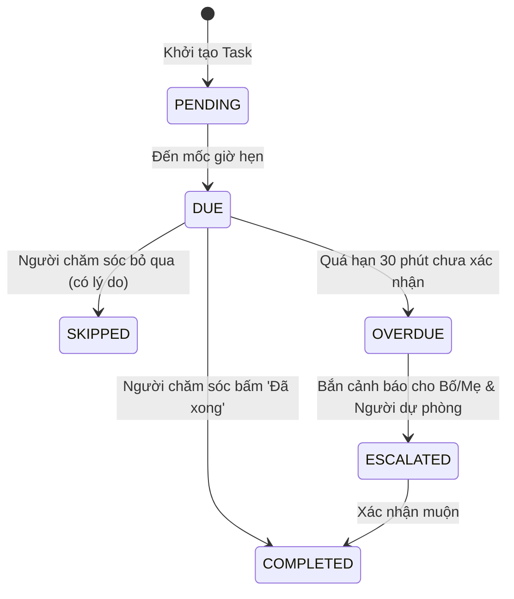

# 🍼 ĐẶC TẢ TÍNH NĂNG: HỆ THỐNG ĐIỀU PHỐI CHĂM SÓC BÉ (BABYCARE COORDINATION)
*Care Coordination, Shared Daily Routine & Handover System for Multi-Caregiver Families*

---

## 1. Bối cảnh & Bài toán Thực tế (Problem Statement)

Trong các gia đình có con nhỏ, khi Bố/Mẹ đi làm, việc chăm sóc thường được giao lại cho **Bà nội, Bà ngoại, Bảo mẫu hoặc Giúp việc**. 

### 🚨 Các Pain Points Lớn:
1. **Gánh nặng "Default Coordinator"**: Một người (thường là Mẹ) trở thành người mặc định phải ghi nhớ mọi thứ, liên tục gọi điện, nhắn tin Zalo nhắc nhở, kiểm tra xem ở nhà bé đã ăn chưa, uống thuốc chưa $\rightarrow$ gây áp lực tâm lý và mệt mỏi.
2. **Giao việc chung chung, thiếu cụ thể**: Các câu nhắc như *"Hôm nay nhớ chăm bé cẩn thận nhé"* gây mơ hồ. Ngược lại, những việc cụ thể, có mốc giờ và hướng dẫn chi tiết sẽ có tỷ lệ thực thi cao hơn rất nhiều.
3. **Phân mảnh kênh giao tiếp**: Dặn dò qua Zalo, gọi điện, giấy note dán tủ lạnh khiến người ở nhà dễ quên hoặc nhầm lẫn cữ sữa/liều thuốc.
4. **Kế hoạch (Plan) $\ne$ Thực tế (Reality)**: Dặn bé bú $150\text{ml}$ lúc $14:30$, nhưng thực tế bé chỉ bú được $110\text{ml}$ lúc $14:45$. Nếu chỉ có nút "Đã xong" đơn thuần thì dữ liệu theo dõi dinh dưỡng bị sai lệch.
5. **Notification Fatigue**: Nhận quá nhiều thông báo vụn vặt gây phiền khi bố mẹ đang làm việc tại công sở.

---

## 2. Mô hình Cốt lõi: Delegate $\rightarrow$ Execute $\rightarrow$ Record $\rightarrow$ Exceptions



---

## 3. Ba Khái niệm Phân định Dữ liệu

| Khái niệm | Ý nghĩa | Ví dụ trong BabyCare |
| :--- | :--- | :--- |
| **`HandoverNote`** *(Context / Bối cảnh)* | Lời dặn dò tổng quan trong ngày từ Bố/Mẹ trước khi đi làm. | *"Hôm nay bé hơi nghẹt mũi, bà nhớ nhỏ nước muối sinh lý trước khi ngủ trưa nhé."* |
| **`CareTask`** *(Plan / Kế hoạch)* | Việc cụ thể cần làm: Làm gì? Khi nào? Ai phụ trách? Hướng dẫn ra sao? | *14:30 — Cữ sữa chiều $150\text{ml}$ (Bà nội phụ trách, hâm ấm $40^\circ\text{C}$).* |
| **`CareEvent`** *(Reality / Thực tế)* | Dữ liệu thực tế diễn ra khi người chăm sóc thực hiện. | *14:40 — Bé bú thực tế được $120\text{ml}$, do Bà thực hiện, ghi nhận bé bú ngoan.* |

---

## 4. Phân Quyền & Vai Trò Trong Gia Đình (Role-Based Permissions)

| Vai trò (Role) | Đối tượng thực tế | Quyền hạn trong Hệ thống |
| :--- | :--- | :--- |
| **`Owner / Primary Admin`** | Mẹ / Bố | • Tạo, sửa, xóa Task & Lịch mẫu định kỳ.<br>• Viết Handover Note buổi sáng.<br>• Mời/hủy quyền người chăm sóc.<br>• Nhận cảnh báo ngoại lệ & báo cáo ngày. |
| **`Caregiver`** | Bà nội, Bà ngoại, Bảo mẫu, Giúp việc | • Xem danh sách việc cần làm trong ngày.<br>• Nút bấm 1-chạm hoàn thành & nhập số liệu thực tế.<br>• Dùng Voice ghi nhận nhanh.<br>• Thêm ghi chú phát sinh trong ngày. |
| **`Viewer / Family`** | Ông nội, Bác, Cô, Dì | • Xem Timeline sinh hoạt của bé.<br>• Xem ảnh và trạng thái hoàn thành (Read-only). |

---

## 5. Vòng Đời Trạng Thái & Cơ Chế Báo Động (State Machine & Escalation)



* **Trạng thái Ngoại lệ (Exception Alert):** Khi task chuyển sang `OVERDUE` hoặc `CareEvent` ghi nhận lượng sữa $< 50\%$ hoặc thân nhiệt $\ge 38.5^\circ\text{C}$, hệ thống lập tức phát thông báo đẩy (Push Notification) đến Bố/Mẹ.

---

## 6. Thiết kế Trải nghiệm Bất Đối xứng (Asymmetric UX)

### A. Phía Bố / Mẹ (Coordination & Monitoring Side)
* **Giao việc siêu tốc:** Nhập bằng giọng nói hoặc chọn từ mẫu lịch định kỳ có sẵn.
* **Theo dõi trực quan:** Xem tiến độ trong ngày theo dạng Timeline (`Đã hoàn thành 4/6 cữ`).
* **Báo cáo cuối ngày (18:00):** Nhận bản tóm tắt tổng thể tình hình chăm sóc bé trong ngày.

### B. Phía Người Bảo Hộ / Ông Bà (Low-Friction Execution Side)
* **Tuyệt đối không bắt người lớn tuổi phải học cách dùng app phức tạp.**
* **Giao diện chữ to, màu sắc dịu nhẹ, nút bấm 1-chạm cực lớn**:
  ```text
  ┌──────────────────────────────────────────────┐
  │  🍼 CỮ SỮA CHIỀU (14:30)                     │
  │  Lượng sữa: 150 ml (Hâm ấm 40°C)             │
  │                                              │
  │  ┌────────────────────────────────────────┐  │
  │  │         ✓ ĐÃ CHO BÉ BÚ XONG            │  │
  │  └────────────────────────────────────────┘  │
  │                                              │
  │  Lượng bé bú thực tế:                        │
  │  [ - 10ml ]   150 ml   [ + 10ml ]            │
  │                                              │
  │  🎤 [Giữ để nói: "Bé bú hết 120ml lúc 2h40"]  │
  └──────────────────────────────────────────────┘
  ```

---

## 7. Cơ Chế Tự Động Đồng Bộ Dữ Liệu 2 Chiều (Bi-Directional Data Sync)

Khi `CareEvent` được tạo, hệ thống tự động đồng bộ sang các module chuyên sâu mà **không cần nhập liệu lại**:
1. `CareEvent(type='feeding')` $\rightarrow$ Tự động tạo bản ghi trong **`NutritionLog`** (Cập nhật tổng lượng sữa & calories trong ngày).
2. `CareEvent(type='medication')` $\rightarrow$ Tự động ghi vào **`HealthRecord`** (Đánh dấu đã uống thuốc, tính thời gian giãn cách cho liều sau).
3. `CareEvent(type='growth')` $\rightarrow$ Tự động cập nhật biểu đồ tăng trưởng **`GrowthTracking`**.

---

## 8. Kiến trúc Dữ liệu Firestore

### Collection 1: `handover_notes`
```json
{
  "id": "handover_20260818_01",
  "baby_id": "baby_leo_01",
  "date": "2026-08-18",
  "created_by": "user_mom_01",
  "author_name": "Mẹ Minh Anh",
  "content": "Bé hơi khụt khịt mũi, bà nhỏ nước muối lúc 10h và 15h. Trưa cho bé ăn cháo cá hồi trong ngăn mát (hâm 2p).",
  "voice_note_url": null,
  "photo_urls": [],
  "acknowledged_by": ["user_grandma_01"],
  "created_at": "2026-08-18T07:15:00Z"
}
```

### Collection 2: `care_tasks` (Task Instances theo ngày)
```json
{
  "id": "task_inst_101",
  "baby_id": "baby_leo_01",
  "template_id": "tmpl_feed_afternoon",
  "task_type": "feeding",
  "title": "Cữ bú sữa chiều",
  "scheduled_time": "2026-08-18T14:30:00Z",
  "assigned_to": "user_grandma_01",
  "assigned_name": "Bà nội",
  "instructions": "150ml sữa Aptamil hâm 40 độ C",
  "target_value": {"amount": 150, "unit": "ml"},
  "status": "completed",
  "priority": "normal",
  "created_at": "2026-08-18T07:00:00Z"
}
```

### Collection 3: `care_events` (Ghi nhận thực tế)
```json
{
  "id": "event_201",
  "task_id": "task_inst_101",
  "baby_id": "baby_leo_01",
  "event_type": "feeding",
  "occurred_at": "2026-08-18T14:38:00Z",
  "recorded_by": "user_grandma_01",
  "actual_value": {"amount": 130, "unit": "ml"},
  "notes": "Bé bú ngoan, để lại 20ml",
  "synced_to_nutrition": true
}
```

---

## 9. Danh Mục API Endpoints Backend (`/api/v1/care-coordination/`)

| Method | Endpoint | Mô tả |
| :--- | :--- | :--- |
| `GET` | `/handover/today?baby_id={id}` | Lấy lời dặn bàn giao hôm nay của bé |
| `POST` | `/handover` | Tạo hoặc cập nhật lời dặn bàn giao |
| `GET` | `/tasks/today?baby_id={id}` | Lấy danh sách việc cần làm trong ngày |
| `POST` | `/tasks` | Bố mẹ tạo việc cụ thể mới (hoặc từ AI Parser) |
| `PATCH` | `/tasks/{task_id}/complete` | Người chăm sóc tick 1-chạm hoàn thành (kèm giá trị thực tế) |
| `POST` | `/events` | Ghi nhận sự kiện chăm sóc phát sinh trực tiếp |
| `GET` | `/summary/daily?baby_id={id}` | Lấy bản tóm tắt tình hình chăm sóc trong ngày từ AI |

---

## 10. Phân Tầng AI Hỗ Trợ (AI Agent Architecture)

1. **Tier 0 Fast-Path Parser (0 LLM, Latency $< 20\text{ms}$):**
   * Tự động trích xuất các câu lệnh tạo lịch / hoàn thành dạng chuẩn:
     * *"Nhắc bà 2 rưỡi chiều cho bé bú 150ml"* $\rightarrow$ Tạo `CareTask`.
     * *"Bà vừa cho bé uống 120ml lúc 2h40"* $\rightarrow$ Tạo `CareEvent` + Đánh dấu `TaskCompleted`.
2. **AI Daily Summary & Coordinator (LLM):**
   * Tổng hợp báo cáo cuối ngày thân thiện, ấm áp: *"Hôm nay bé Bo đã hoàn thành 5/6 việc (đã bú 450ml sữa, ngủ 2.5 tiếng, uống đủ D3). Mẹ chuẩn bị cữ sữa tối 19h30 nhé!"*.
   * Phát hiện xu hướng: *"Trong 3 ngày qua bé đều bú thiếu cữ chiều (trung bình 90/150ml), mẹ có thể dời cữ trưa sớm hơn 30 phút để bé đói hơn nhé."*

---

## 11. Lộ Trình Triển Khai (Implementation Roadmap)

### 📌 Giai đoạn 1 (MVP Cốt lõi)
* [x] Đặc tả kiến trúc & mô hình dữ liệu hoàn chỉnh.
* [ ] Xây dựng Backend Module: `app/modules/care_coordination/` (Schemas, Repository, Service, Router).
* [ ] Xây dựng Frontend UI:
  * Widget **Sổ Bàn Giao & Lịch Chăm Sóc** trên Dashboard.
  * Giao diện Phụ huynh (Lên lịch, dặn dò).
  * Giao diện Người chăm sóc (1-tap complete, nút to, hỗ trợ người lớn tuổi).

### 📌 Giai đoạn 2 (Tích hợp AI & Cảnh Báo Ngoại Lệ)
* [ ] Tích hợp `CareCoordinationTool` vào hệ thống AI Agent (LangGraph / Fast-Path).
* [ ] Cơ chế quét Background Job phát hiện Task quá hạn (Overdue) để gửi Alert.
* [ ] AI Tổng kết Chăm sóc Cuối ngày (Daily Care Summary).

### 📌 Giai đoạn 3 (Nâng cao)
* [ ] Cân bằng khối lượng công việc (Workload Visibility) giữa các thành viên.
* [ ] Tự động chuyển giao task (Escalation) cho người dự phòng (Backup Caregiver) khi người chính không phản hồi.