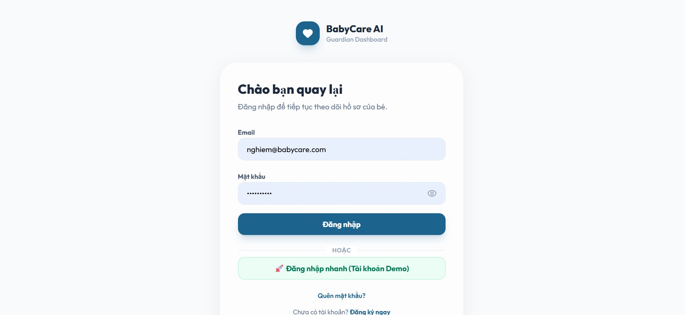
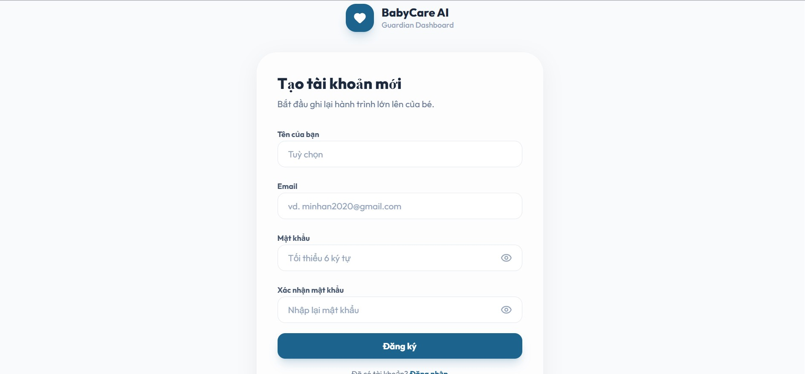
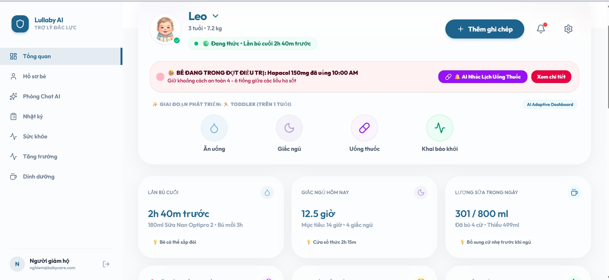
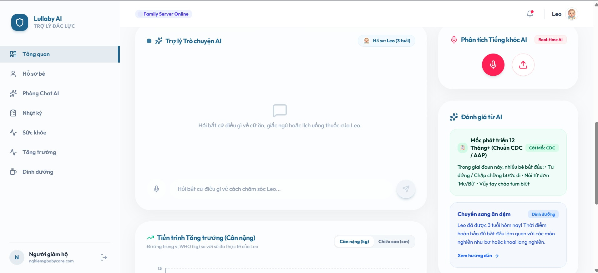
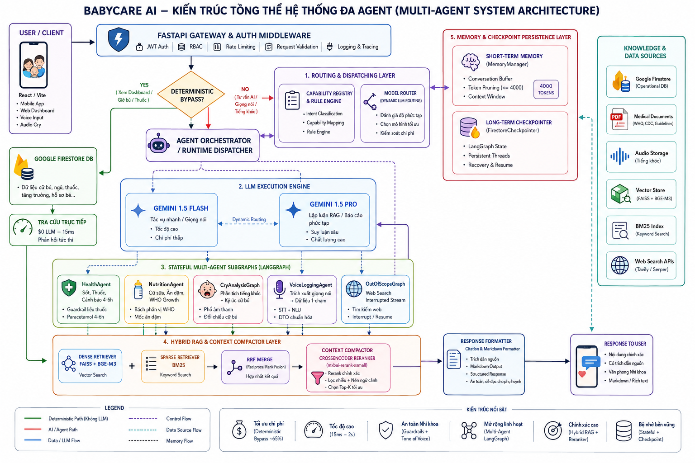
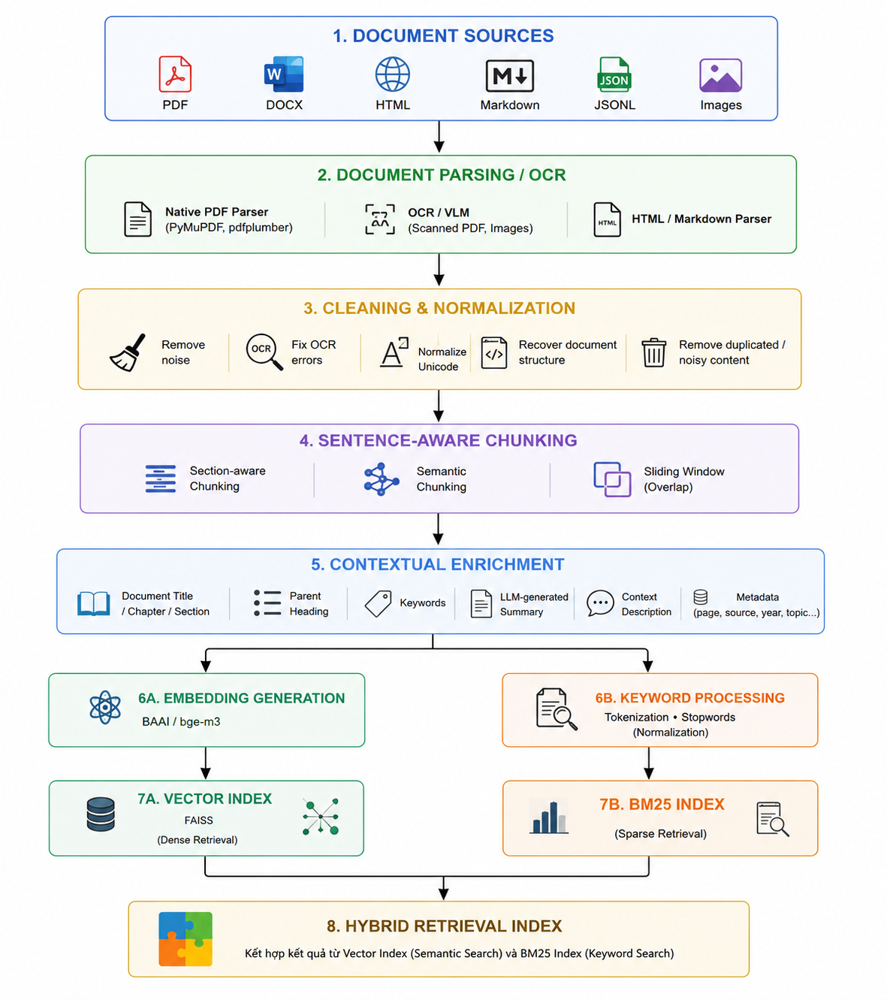
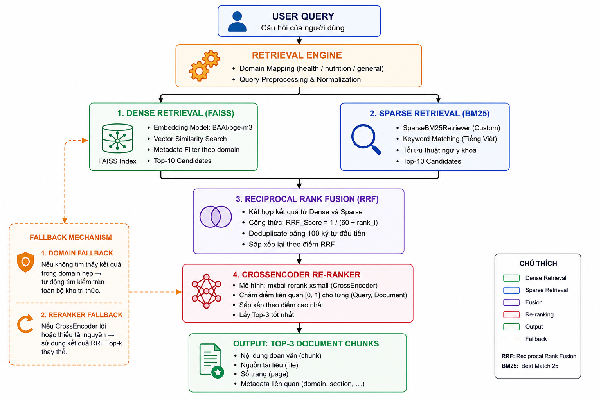

# 🍼 BabyCare AI — Nền Tảng Chăm Sóc Trẻ Sơ Sinh Thông Minh

<p align="center">
  
  
  
  
  
</p>

**BabyCare AI** là nền tảng chăm sóc trẻ sơ sinh toàn diện, kết hợp trí tuệ nhân tạo (AI), đồ thị tác tử đa tác nhân (Multi-Agent LangGraph) và mô hình phân loại tiếng khóc sâu (PyTorch AST) giúp cha mẹ chăm sóc bé thông minh hơn, chính xác hơn.

<p align="center">
  
  
  <br>
  <em>Giao diện Đăng nhập & Đăng ký tài khoản dành cho Phụ huynh</em>
</p>

---

## ✨ Tính Năng Nổi Bật

| Tính Năng | Mô Tả |
|---|---|
| 🔊 **Nhận Diện Tiếng Khóc AI** | Mô hình AST (Audio Spectrogram Transformer) PyTorch nhận dạng **8 loại khóc** (*Đói, Gắt ngủ, Đau bụng, Cần ợ hơi, Bẩn tã, Khó chịu, Cần bế, Giật mình*) với điểm tin cậy đa lớp % |
| 🤖 **Trợ Lý AI Đa Tác Nhân** | Orchestrator LangGraph định tuyến thông minh sang 5 luồng con: Chat tư vấn nhi khoa, Tạo báo cáo PDF, Ghi nhật ký bằng giọng nói, Tra cứu web thời gian thực, Xử lý ngoài phạm vi |
| 🍼 **Dinh Dưỡng & Ăn Dặm** | Quản lý cữ bú (ml sữa mẹ/công thức), theo dõi ăn dặm, phát hiện dị ứng nguyên liệu, cảnh báo thực phẩm cấm theo độ tuổi (WHO/AAP) |
| 📈 **Tăng Trưởng Chuẩn WHO** | Lưu trữ và tự động tính bách phân vị cân nặng, chiều cao, vòng đầu theo biểu đồ WHO chuẩn quốc tế |
| 🏥 **Nhật Ký Sức Khỏe & Thuốc** | Ghi nhận triệu chứng, bệnh án, liều lượng thuốc; tự động khoá nút và đếm ngược an toàn Paracetamol (≥ 4 tiếng/liều) |
| 📊 **Xuất Báo Cáo PDF** | AI tổng hợp toàn bộ dữ liệu tăng trưởng, dinh dưỡng và sức khỏe thành báo cáo PDF y khoa chuyên nghiệp |
| 🎤 **Nhật Ký Giọng Nói** | Bóc tách nhật ký ăn uống/sức khỏe từ giọng nói của cha mẹ bằng Gemini Multimodal |
| 🌐 **Tra Cứu Web Thời Gian Thực** | Tích hợp Tavily Search (fallback DuckDuckGo) khi câu hỏi vượt ngoài kiến thức nội bộ |
| 👨‍👩‍👧 **Đồng Bộ Gia Đình** | Mời và phân quyền chia sẻ dữ liệu bé giữa cha, mẹ và người giám hộ |
| ⏱️ **Bấm Giờ Giấc Ngủ** | Đo lường và lưu trữ nhật ký giấc ngủ tự động |

### 🎨 Giao Diện Ứng Dụng (Application UI Showcase)

<p align="center">
  
  <br>
  <em>Giao diện Dashboard: Các thẻ sinh hiệu thời gian thực & Khối AI phân tích tiếng khóc nhi khoa</em>
</p>

<br>

<p align="center">
  
  <br>
  <em>Giao diện Dashboard: Tiến trình đường cong tăng trưởng chuẩn WHO & Đánh giá AI Insights</em>
</p>

---

## 🏗️ Kiến Trúc Hệ Thống

<p align="center">
  
  <br>
  <em>Sơ đồ Kiến trúc Tổng thể Hệ thống BabyCare AI Platform (Frontend React, Backend FastAPI, LangGraph & PyTorch AST)</em>
</p>

<br>

```
┌─────────────────────────────────────────────────────────────────┐
│                    BABYCARE AI PLATFORM                         │
│                                                                  │
│  ┌──────────────────┐        ┌──────────────────────────────┐  │
│  │   FRONTEND       │ HTTP   │        BACKEND               │  │
│  │  React + Vite    │◄──────►│       FastAPI (Python)        │  │
│  │  TypeScript      │  :8000 │                              │  │
│  │  Framer Motion   │        │  ┌─────────────────────────┐ │  │
│  └──────────────────┘        │  │    AI Agent Layer        │ │  │
│                              │  │  LangGraph Orchestrator   │ │  │
│                              │  │  ├── ChatGraph            │ │  │
│                              │  │  ├── ReportGraph (PDF)    │ │  │
│                              │  │  ├── VoiceLoggingGraph    │ │  │
│                              │  │  ├── CryAnalysisGraph     │ │  │
│                              │  │  └── OutOfScopeGraph      │ │  │
│                              │  └─────────────────────────┘ │  │
│                              │                              │  │
│                              │  ┌─────────────────────────┐ │  │
│                              │  │   ML Inference Layer      │ │  │
│                              │  │  PyTorch AST Model       │ │  │
│                              │  │  (Audio Spectrogram       │ │  │
│                              │  │   Transformer — 333MB)   │ │  │
│                              │  └─────────────────────────┘ │  │
│                              │                              │  │
│                              │  ┌─────────────────────────┐ │  │
│                              │  │   Data Layer             │ │  │
│                              │  │  Google Cloud Firestore  │ │  │
│                              │  │  + Local Static Files    │ │  │
│                              │  └─────────────────────────┘ │  │
│                              └──────────────────────────────┘  │
└─────────────────────────────────────────────────────────────────┘
```

---

## 📁 Cấu Trúc Mã Nguồn

```text
babycare-ai/
├── app/                              # 🐍 BACKEND LAYER (FastAPI)
│   ├── core/                         # Cấu hình, middleware, lifespan, email service
│   ├── infrastructure/               # Khởi tạo kết nối Firestore
│   ├── modules/                      # Các module nghiệp vụ RESTful API
│   │   ├── auth/                     # Xác thực JWT & quản lý người dùng
│   │   ├── baby/                     # Hồ sơ em bé (CRUD)
│   │   ├── growth_tracking/          # Tăng trưởng & bách phân vị WHO
│   │   ├── health_records/           # Bệnh án & triệu chứng sức khỏe
│   │   ├── nutrition/                # Cữ bú, ăn dặm, dị ứng & hướng dẫn WHO/AAP
│   │   ├── cry/                      # Upload & phân tích tiếng khóc AI
│   │   ├── guardian/                 # Người giám hộ & phân quyền gia đình
│   │   └── ai_agent/                 # Chat AI, giọng nói, báo cáo & sleep timer
│   ├── AI_agents/                    # 🤖 MULTI-AGENT AI LAYER (LangGraph)
│   │   ├── orchestrator/             # Agent Orchestrator + State Manager
│   │   ├── workflows/                # Đồ thị tác nhân (Chat, Report, Voice, CryAnalysis)
│   │   ├── agents/                   # Các tác nhân chuyên biệt
│   │   ├── tools/                    # Công cụ: WebSearch (Tavily/DuckDuckGo), RAG, CryTools
│   │   ├── memory/                   # Bộ nhớ ngữ nghĩa HuggingFace + FAISS
│   │   ├── knowledge/                # Cơ sở tri thức nhi khoa RAG (FAISS vector store)
│   │   ├── prompts/                  # Hệ thống prompt chuyên biệt cho từng tác nhân
│   │   ├── core/                     # Hằng số, mô hình suy luận (Gemini Pro/Flash)
│   │   └── utils/                    # Các tiện ích hỗ trợ
│   ├── ai/                           # 🔊 ML INFERENCE LAYER (PyTorch)
│   │   ├── CRY/                      # Mô hình AST nhận dạng tiếng khóc
│   │   │   ├── inference.py          # Trích xuất đặc trưng Kaldi fbank + suy luận AST
│   │   │   ├── models/ast_models.py  # Kiến trúc Audio Spectrogram Transformer
│   │   │   ├── data/                 # Nhãn phân loại (esc_class_labels_indices.csv)
│   │   │   └── weights/              # ⚠️ best_audio_model.pth (333 MB — không push Git)
│   │   ├── cry_detection/            # Tiền xử lý âm thanh & ánh xạ nhãn khóc → nhạc dỗ
│   │   └── voice_clone/              # Nhân bản giọng nói mẹ để dỗ bé
│   └── static/                       # File tĩnh phục vụ qua /static
│       ├── img/                      # Avatar em bé (leo.png, bo.png)
│       ├── cry/                      # File âm thanh upload (*.gitkeep)
│       ├── reports/                  # Báo cáo PDF xuất bản (*.gitkeep)
│       ├── sounds/                   # Nhạc ru & tiếng ồn trắng dỗ bé
│       ├── samples/                  # Âm thanh mẫu kiểm thử
│       └── voices/                   # Giọng nói nhân bản của mẹ
│
├── frontend/                         # ⚛️ FRONTEND LAYER (React + Vite + TypeScript)
│   ├── src/
│   │   ├── components/               # Các View đã Việt hóa
│   │   │   ├── DashboardView.tsx     # Tổng quan + Phân tích tiếng khóc AI
│   │   │   ├── AiHubView.tsx         # Phòng Chat AI + Upload file
│   │   │   ├── NutritionView.tsx     # Dinh dưỡng, dị ứng & cẩm nang an toàn
│   │   │   ├── GrowthView.tsx        # Biểu đồ tăng trưởng WHO
│   │   │   ├── HealthView.tsx        # Sức khỏe & nhật ký thuốc
│   │   │   ├── LogsView.tsx          # Nhật ký tổng hợp
│   │   │   └── ProfileView.tsx       # Hồ sơ em bé & người giám hộ
│   │   ├── App.tsx                   # Điều phối routing & trạng thái toàn cục
│   │   ├── types.ts                  # Định nghĩa kiểu dữ liệu TypeScript
│   │   └── data.ts                   # Dữ liệu mẫu khởi tạo
│   └── package.json
│
├── tests/
│   └── unit/
│       └── test_ai_core.py           # 21 unit test tự động (AI Core, Memory, Tools)
│
├── scripts/                          # Công cụ seed & kiểm thử thủ công
├── requirements.txt                  # Phụ thuộc Python
├── .env.example                      # Mẫu biến môi trường
├── .gitignore                        # Bỏ qua model weights, uploads, secrets
└── pyproject.toml                    # Cấu hình pytest
```

---

## 🚀 Hướng Dẫn Cài Đặt & Khởi Chạy

### Yêu Cầu Hệ Thống

- Python **3.11+**
- Node.js **18+**
- Tài khoản **Google Firebase** (Firestore)
- API Key **Google Gemini** (bắt buộc)
- API Key **Tavily** (tuỳ chọn — dùng DuckDuckGo nếu không có)

### 1. Cài Đặt Backend

```bash
# Tạo và kích hoạt môi trường ảo Python
python -m venv venv
.\venv\Scripts\activate        # Windows PowerShell
# source venv/bin/activate     # macOS / Linux

# Cài đặt phụ thuộc
pip install -r requirements.txt
```

### 2. Cấu Hình Biến Môi Trường

Tạo file `.env` tại thư mục gốc từ file mẫu:

```bash
cp .env.example .env
```

Điền các giá trị vào `.env`:

```env
# Google Gemini AI
GEMINI_API_KEY=AIzaSy...

# Firebase Admin SDK
FIREBASE_CREDENTIALS_PATH=path/to/firebase-adminsdk.json
# hoặc nội dung JSON trực tiếp:
# FIREBASE_CREDENTIALS_JSON={"type": "service_account", ...}

# Tavily Web Search (tuỳ chọn)
TAVILY_API_KEY=tvly-...
```

### 3. Tải Model Trọng Số AI Tiếng Khóc

> ⚠️ File trọng số `best_audio_model.pth` (333 MB) **không được push lên Git** do giới hạn kích thước.
> Tải thủ công và đặt vào đúng thư mục:

```bash
# Tải từ Google Drive / HuggingFace (liên hệ team để nhận link)
# Đặt vào:
app/ai/CRY/weights/best_audio_model.pth
```

### 4. Khởi Chạy Backend (FastAPI)

```bash
fastapi dev app/main.py
# Backend: http://localhost:8000
# Swagger UI: http://localhost:8000/docs
```

### 5. Khởi Chạy Frontend (React + Vite)

```bash
cd frontend
npm install
npm run dev
# Frontend: http://localhost:5173
```

---

## 🧪 Kiểm Thử Tự Động & Đánh Giá AI (Evaluation Benchmark)

### 1. Unit Tests Hệ Thống

```bash
# Chạy toàn bộ 21 unit test tự động (AI Core, Memory, Tools)
.\venv\Scripts\python.exe -m pytest tests/unit/test_ai_core.py -v

# Kết quả: 21 passed (100% thành công)
```

### 2. Chỉ Số Đánh Giá Bộ Truy Xuất RAG Y Khoa (MedicalRetriever Evaluation)

Báo cáo kiểm định chất lượng tự động của **MedicalRetriever (FAISS + BAAI/bge-m3)** trên tập dữ liệu chuẩn Golden Dataset (`tests/evaluation/local_retriever_report.md`):

| Chỉ số Đánh Giá | Giá trị Trung bình | Mô tả Chi tiết |
| :--- | :---: | :--- |
| 🎯 **Mean Hit@3** | **`1.00` (100%)** | Tỷ lệ tìm thấy tài liệu y tế chuẩn trong Top 3 kết quả |
| 🎯 **Mean Hit@5** | **`1.00` (100%)** | Tỷ lệ tìm thấy tài liệu y tế chuẩn trong Top 5 kết quả |
| 🏆 **MRR (Mean Reciprocal Rank)** | **`0.92` (92%)** | Thứ hạng vị trí đúng trung bình trong kết quả tìm kiếm |
| 🥇 **Mean Hit@1** | **`0.83` (83%)** | Tỷ lệ tìm thấy đúng ngay vị trí đầu tiên (#1) |

#### 📝 Kết Quả Kiểm Thử Thực Tế Theo Các Kịch Bản Nhi Khoa Tiêu Biểu

| STT | Kịch Bản Y Tế Phụ Huynh Hỏi | Từ Khóa Y Khoa Mong Đợi | Hit@1 | Hit@3 | Hit@5 | MRR |
| :---: | :--- | :--- | :---: | :---: | :---: | :---: |
| 1 | *Lời khuyên rèn bé sơ sinh tự ngủ* | `['quấy khóc', 'tự ngủ', 'buồn ngủ']` | **1.00** | **1.00** | **1.00** | **1.00** |
| 2 | *Bé mấy tháng tuổi tập ngồi được* | `['phát triển', 'tháng', 'tập ngồi']` | **1.00** | **1.00** | **1.00** | **1.00** |
| 3 | *Bé sốt nóng đầu 38.8 độ C làm sao* | `['sốt', 'Hapacol', 'nhiệt độ', 'Paracetamol']` | **1.00** | **1.00** | **1.00** | **1.00** |
| 4 | *Uống Hapacol 150mg 8h, 11h sốt lại có uống tiếp được không* | `['Hapacol', 'Paracetamol', 'liều', 'tiếng']` | **1.00** | **1.00** | **1.00** | **1.00** |
| 5 | *Thực đơn ăn dặm tuần đầu tiên* | `['ăn dặm', 'cháo rây', 'thực đơn', 'nhóm']` | **1.00** | **1.00** | **1.00** | **1.00** |

---

## 🌐 Tổng Quan Các API Endpoint

| Method | Endpoint | Chức Năng |
|---|---|---|
| `POST` | `/api/v1/auth/login` | Đăng nhập & cấp JWT Token |
| `GET/POST` | `/api/v1/babies/` | Quản lý hồ sơ em bé |
| `POST` | `/api/v1/babies/{id}/cry-prediction` | Phân tích tiếng khóc AI (upload .wav/.mp3) |
| `GET/POST` | `/api/v1/growth/` | Nhật ký tăng trưởng & bách phân vị |
| `GET/POST` | `/api/v1/health/` | Bệnh án & nhật ký sức khỏe |
| `GET/POST` | `/api/v1/nutrition/feeds` | Cữ bú & ăn dặm |
| `GET` | `/api/v1/nutrition/safety-guidelines` | Cảnh báo dị ứng & thực phẩm cấm theo tuổi |
| `GET` | `/api/v1/nutrition/safety-handbook` | Cẩm nang an toàn y khoa WHO/AAP |
| `GET/POST` | `/api/v1/ai/threads` | Quản lý phiên chat AI (giới hạn 6 gần nhất) |
| `POST` | `/api/v1/ai/threads/{id}/messages` | Gửi tin nhắn & nhận phản hồi AI |
| `POST` | `/api/v1/ai/voice-extract` | Bóc tách nhật ký từ giọng nói |
| `POST` | `/api/v1/ai/reports/generate` | Tạo báo cáo PDF y khoa bằng AI |
| `GET/POST` | `/api/v1/guardians/` | Quản lý người giám hộ & phân quyền |

---

## 🤖 Kiến Trúc AI Agent — Phân Tích Chi Tiết (LangGraph)

<p align="center">
  
  <br>
  <em>Sơ đồ Đồ Thị Tác Nhân Đa Agent Multi-Agent LangGraph Orchestrator & Các Subgraph Chuyên Biệt</em>
</p>

<br>

### Orchestrator — Điều Phối Trung Tâm

[`AgentOrchestrator`](app/AI_agents/orchestrator/agent_orchestrator.py) là điểm vào duy nhất cho mọi yêu cầu AI. Sử dụng **Firestore Checkpointer** để lưu trữ trạng thái hội thoại bền vững:

| Phương thức | Mô tả |
|---|---|
| `run_agent()` | Khởi chạy đồ thị bất đồng bộ với `thread_id` để duy trì lịch sử hội thoại |
| `resume_agent()` | Tiếp tục đồ thị bị tạm dừng tại `interrupt_before` checkpoint (**Human-in-the-Loop**) |
| `get_state()` | Kiểm tra trạng thái hiện tại & nút tiếp theo của luồng đang chạy |

---

### RouterGraph — Định Tuyến 7 Luồng Con

[`RouterGraph`](app/AI_agents/workflows/router_graph.py) sử dụng Gemini Flash phân loại intent và điều phối sang đúng subgraph:

```
User Message
     │
     ▼
┌──────────────────────┐
│   classify_intent     │  ← Gemini Flash phân tích intent
│   (TaskPlanner)       │
└──────────┬───────────┘
           │
    ┌──────┴──────────────────────────────────────────────┐
    │        │          │         │         │         │   │
    ▼        ▼          ▼         ▼         ▼         ▼   ▼
  Chat    Voice      Cry       Health  Nutrition  Report  Out-of-
 Graph   Logging   Analysis    Graph    Graph     Graph   Scope
(tư vấn) Graph    Graph    (sức khỏe)(dinh dưỡng)(PDF)  (WebSearch)
```

| Intent | Subgraph | Khi nào kích hoạt |
|---|---|---|
| `chat` | ChatGraph | Hỏi đáp chung về chăm sóc bé |
| `log_activity` | VoiceLoggingGraph | *"Bé uống 150ml sữa lúc 8 giờ"* |
| `analyze_cry` | CryAnalysisGraph | Upload file tiếng khóc để phân tích |
| `check_health` | HealthGraph | Hỏi triệu chứng, bệnh án, thuốc |
| `check_nutrition` | NutritionGraph | Hỏi thực đơn, ăn dặm, dinh dưỡng |
| `generate_report` | ReportGraph | *"Xuất báo cáo phát triển cho bé"* |
| `out_of_scope` | OutOfScopeGraph | Câu hỏi ngoài phạm vi kiến thức |

---

### Chi Tiết Các Subgraph

#### 💬 ChatGraph
Tư vấn nhi khoa tổng quát kết hợp **RAG nhi khoa** + **Bộ nhớ ngắn hạn** (15 tin nhắn gần nhất) sử dụng Gemini Flash.

#### 🎤 VoiceLoggingGraph
Bóc tách thông tin từ giọng nói/văn bản tự do và tự động tạo thẻ lưu nhanh nhật ký ăn uống, sức khỏe.

#### 🔊 CryAnalysisGraph
Kích hoạt pipeline PyTorch AST để phân loại 8 loại khóc, trả về điểm tin cậy đa lớp % kèm đề xuất nhạc dỗ phù hợp.

#### 🏥 HealthGraph
Quy trình 3 bước tự động:
1. **Tính tuổi bé** từ Firestore → lọc tài liệu y khoa theo độ tuổi
2. **Truy vấn 3 bệnh án** gần nhất làm ngữ cảnh bác sĩ
3. **RAG tra cứu** với bộ lọc `{"category": "health", "baby_age": X}`

#### 🍼 NutritionGraph
Quy trình 4 bước tự động:
1. **Tính tuổi bé** (tháng)
2. **Lấy 5 nhật ký ăn dặm** gần nhất
3. **Lấy chỉ số tăng trưởng** (chiều cao, cân nặng) gần nhất
4. **RAG dinh dưỡng** với filter `{"category": "nutrition", "baby_age": X}` + Prompt chuyên biệt `nutrition.txt`

#### 📊 ReportGraph
Quy trình 3 nút LangGraph tuần tự:
```
fetch_logs → generate_summary → export_pdf
```
AI tổng hợp toàn bộ hồ sơ bé, lịch sử tăng trưởng, dinh dưỡng và bệnh án thành báo cáo PDF chuyên nghiệp lưu tại `app/static/reports/`.

#### 🌐 OutOfScopeGraph ← Human-in-the-Loop
Tính năng nâng cao nhất — khi AI tìm kiếm web xong, đồ thị **tạm dừng** tại `interrupt_before=["web_finalize"]`:
```
web_search → [PAUSE: Frontend xem kết quả] → web_finalize → END
```
Frontend gọi `resume_agent()` sau khi người dùng xem & duyệt kết quả tìm kiếm, rồi AI mới tổng hợp câu trả lời cuối.

---

### 🧠 RAG Pipeline — Toàn Bộ Luồng Xử Lý Chi Tiết

Hệ thống RAG (Retrieval-Augmented Generation) gồm **2 giai đoạn chính**: Ingestion (nạp và xây dựng chỉ mục) và Retrieval (truy xuất khi có câu hỏi).

---

#### 📥 Giai Đoạn 1: Ingestion — Xây Dựng Cơ Sở Tri Thức

<p align="center">
  
  <br>
  <em>Sơ đồ Quy trình Nạp & Xây dựng Chỉ mục Tri thức (Ingestion Pipeline)</em>
</p>

<br>

```
Tài liệu nguồn (PDF, JSONL, MD, TXT)
         │
         ▼
┌─────────────────────────────────┐
│       DocumentLoader            │  ← document_loader.py
│  Hỗ trợ: .pdf (pypdf)          │
│           .jsonl (enriched)     │
│           .md / .txt            │
└──────────────┬──────────────────┘
               │
               ▼
┌─────────────────────────────────┐
│    Metadata Enrichment          │  ← Tự động gán metadata theo tên file
│  • category: health/nutrition   │
│  • age_min_months / max_months  │
│  • content_type: guideline/recipe│
│  • source, page, line           │
│  • original_text, context       │
└──────────────┬──────────────────┘
               │
       ┌───────┴──────────────────┐
       ▼                          ▼
┌─────────────────┐    ┌──────────────────────────┐
│  FAISS Index    │    │   BM25 Index             │
│  (Dense)        │    │   (Sparse)               │
│  Model: BAAI/   │    │   SparseBM25Retriever    │
│  bge-m3 (CPU)   │    │   (tự implement, không   │
│  dim=1024       │    │   phụ thuộc thư viện)    │
│  Lưu local disk │    │   k1=1.5, b=0.75         │
└─────────────────┘    └──────────────────────────┘
```

**Tài liệu nhi khoa hiện có trong cơ sở tri thức:**

| Tệp | Kích thước | Nội dung |
|---|---|---|
| `enriched_chunks.jsonl` | 763 KB | Các chunk đã được làm giàu ngữ cảnh (enriched), metadata đầy đủ |
| `healthy_document.pdf` | 3.1 MB | Tài liệu y khoa nhi khoa tổng hợp (0–60 tháng tuổi) |
| `parenting_guidelines.md` | Nhỏ | Hướng dẫn chăm sóc bé sơ sinh cơ bản (Hapacol, colic, khóc) |

> 💡 **JSONL được ưu tiên**: Nếu thư mục có `.jsonl`, hệ thống bỏ qua `.pdf`/`.md` và chỉ load JSONL đã enriched để đảm bảo chất lượng chunk tối ưu.

---

#### 🔍 Giai Đoạn 2: Retrieval — Truy Xuất Khi Có Câu Hỏi

<p align="center">
  
  <br>
  <em>Sơ đồ Quy trình Truy xuất Hybrid Search (Dense + Sparse) & Re-ranking (Retrieval Pipeline)</em>
</p>

<br>

```
Câu hỏi người dùng
         │
         ▼
┌─────────────────────────────────────────────────────┐
│              Metadata Filter (Bộ Lọc)               │
│  • category = "health" hoặc "nutrition"             │
│  • age_min_months ≤ tuổi_bé ≤ age_max_months        │
│    (tự động tính từ ngày sinh bé trong Firestore)   │
└────────────────────┬────────────────────────────────┘
                     │
          ┌──────────┴──────────┐
          ▼                     ▼
┌──────────────────┐   ┌──────────────────┐
│  Dense Retrieval │   │ Sparse Retrieval  │
│  FAISS vector    │   │  BM25 từ khoá    │
│  search          │   │  (tokenizer hỗ   │
│  (ngữ nghĩa)    │   │   trợ Tiếng Việt)│
│  k=10 candidates │   │  k=10 candidates │
└────────┬─────────┘   └────────┬─────────┘
         │                      │
         └──────────┬───────────┘
                    ▼
         ┌──────────────────────┐
         │  Merge + Dedup       │
         │  (so sánh page_content│
         │   để loại trùng lặp) │
         └──────────┬───────────┘
                    ▼
         ┌──────────────────────┐
         │   CrossEncoder       │  ← LocalReranker (reranker.py)
         │   Reranker (CPU)     │    sentence-transformers
         │                      │    Dự đoán điểm liên quan
         │  Input: (query, doc) │    cho từng cặp (query, chunk)
         │  Output: score [0,1] │
         └──────────┬───────────┘
                    ▼
         ┌──────────────────────┐
         │   Top-3 Chunks       │  ← Kết quả tốt nhất
         │   (đã reranked)      │    được đưa vào prompt AI
         └──────────────────────┘
                    │
                    ▼
         ┌──────────────────────┐
         │   Gemini Flash/Pro   │
         │   + Retrieved Chunks │
         │   → Câu trả lời      │
         │     có dẫn nguồn     │
         └──────────────────────┘
```

**Mô hình sử dụng trong RAG:**

| Thành phần | Mô hình | Ghi chú |
|---|---|---|
| **Embedding** | `BAAI/bge-m3` (HuggingFace) | Hỗ trợ đa ngôn ngữ, chiều 1024 |
| **Vector Store** | FAISS (Meta) | Lưu local disk, load khi khởi động |
| **Sparse Search** | BM25 tự implement | Không phụ thuộc thư viện ngoài |
| **Reranker** | CrossEncoder (sentence-transformers) | Chạy CPU, lazy init để tiết kiệm RAM |
| **Generator** | Gemini Flash / Gemini Pro | Tổng hợp câu trả lời cuối |

---


### 🛠️ Bộ Công Cụ (10 Tools)

| Tool | Chức năng |
|---|---|
| `baby_tools.py` | Đọc hồ sơ & thông tin em bé từ Firestore |
| `health_tools.py` | Truy vấn bệnh án, triệu chứng |
| `nutrition_tools.py` | Nhật ký ăn dặm & cữ bú |
| `growth_tools.py` | Số liệu tăng trưởng WHO |
| `cry_tools.py` | Kích hoạt phân tích tiếng khóc AST |
| `web_search_tool.py` | Tavily Search → DuckDuckGo (fallback tự động) |
| `rag_tools.py` | Tra cứu cơ sở tri thức nhi khoa |
| `calendar_tool.py` | Tiện ích lịch & tính ngày giờ |
| `email_tool.py` | Gửi email thông báo cho phụ huynh |
| `tool_registry.py` | Tự động đăng ký & quản lý tất cả tools |

---

## 🔒 Bảo Mật

- **JWT Authentication**: Mọi endpoint đều yêu cầu Bearer token (Firebase Auth).
- **Firebase Firestore Rules**: Dữ liệu em bé được phân quyền theo `user_id`.
- **Secrets Management**: Tất cả credentials được quản lý qua `.env` (không push lên Git).
- **File Upload Safety**: Kiểm tra định dạng âm thanh và giới hạn kích thước file upload.
- **Model Weights**: File trọng số `.pth` (333 MB) bị loại khỏi Git theo `.gitignore`.

---

## 📜 Giấy Phép

Dự án nghiên cứu & phát triển nội bộ — **BabyCare AI Team**.

