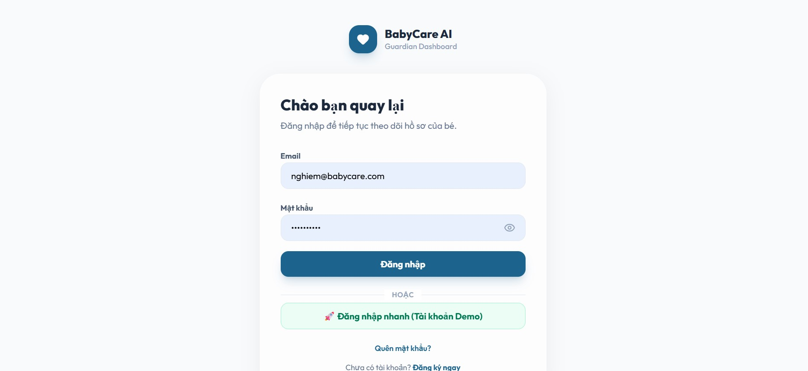
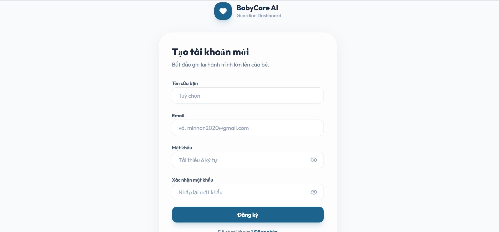
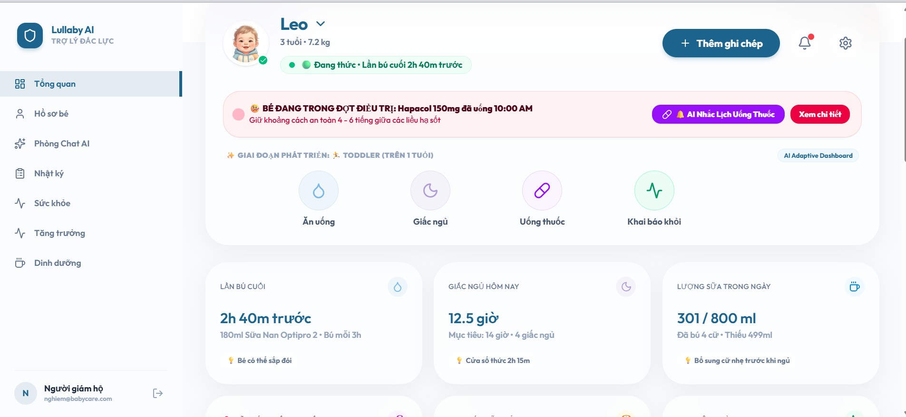
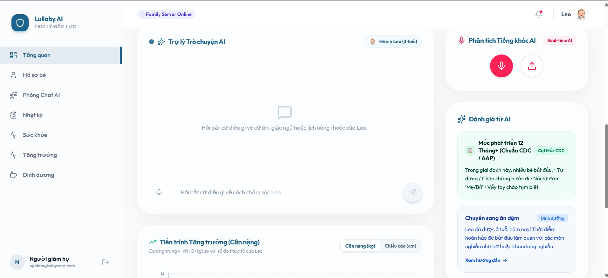
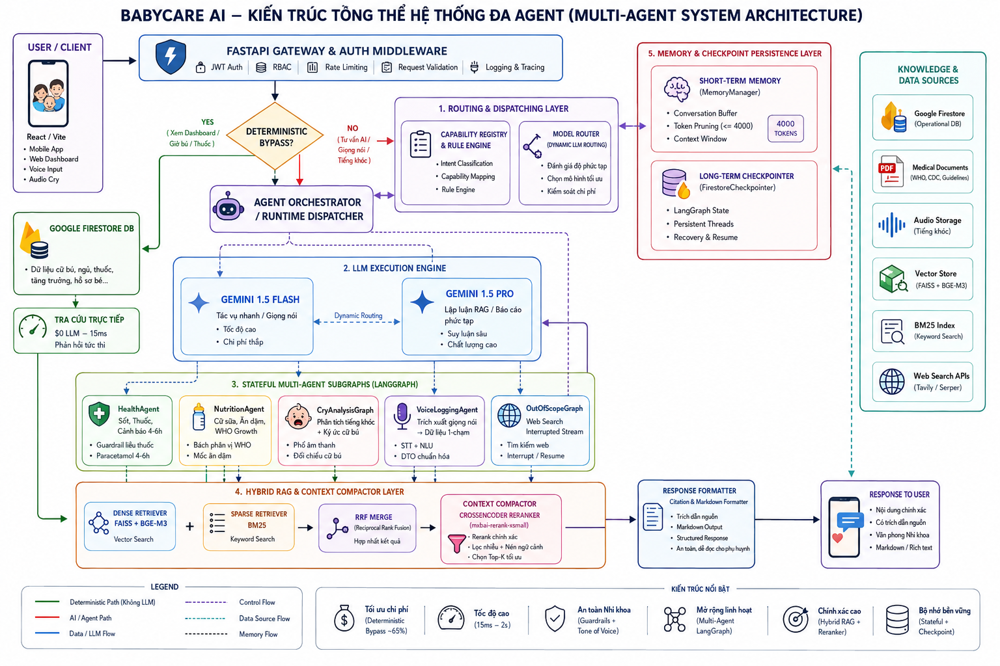
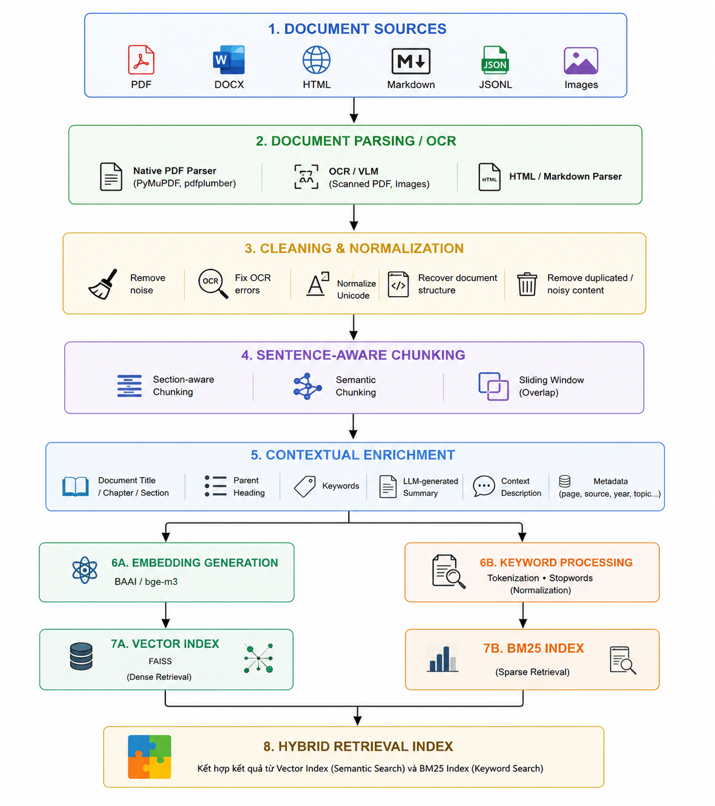
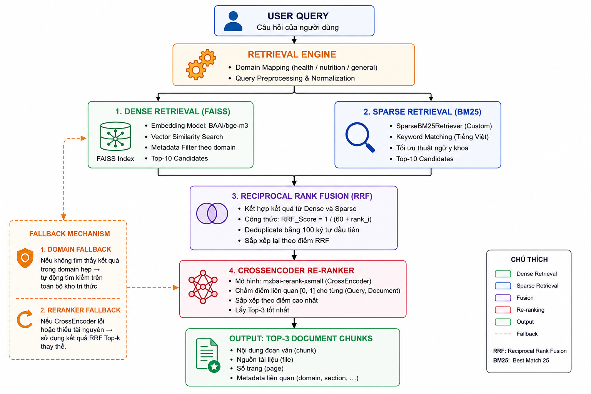

# 🍼 BabyCare AI — Nền Tảng Chăm Sóc Trẻ Sơ Sinh Thông Minh

<p align="center">
  
  
  
  
  
  
  
</p>

**BabyCare AI** là nền tảng chăm sóc trẻ sơ sinh toàn diện, kết hợp trí tuệ nhân tạo (AI), đồ thị tác tử đa tác nhân (**Multi-Agent LangGraph**), cơ sở tri thức y khoa RAG (**Hybrid Search & Re-ranking**) và mô hình phân loại tiếng khóc sâu (**PyTorch AST**) giúp cha mẹ đồng hành cùng sự phát triển của bé yêu một cách nhẹ nhàng, khoa học và an tâm tuyệt đối.

---

## 🧭 Bảng Điều Hướng Nhanh Theo Nhánh & Vai Trò (Branch Navigation)

Kho mã nguồn BabyCare AI được cấu trúc tối ưu theo mô hình **Gitflow & MLOps**. Bạn có thể truy cập nhanh vào phần nội dung phù hợp với nhu cầu của mình:

| Nhánh GitHub | Định Vị & Vai Trò | Liên Kết Truy Cập Nhanh |
|:---|:---|:---|
| 🌟 **`main`** | **Tổng Quan Sản Phẩm & Trải Nghiệm Demo**<br>*(Dành cho phụ huynh, đối tác, nhà tuyển dụng)* | ▫️ [Tổng Quan & UI Showcase](#ui-showcase)<br>▫️ [Tính Năng Nổi Bật](#tinh-nang-noi-bat)<br>▫️ [Đăng Nhập Tài Khoản Demo](#tai-khoan-demo)<br>▫️ [Chuẩn Y Tế & An Toàn Dữ Liệu](#an-toan-y-te) |
| 💻 **`develop`** | **Kỹ Thuật & Cẩm Nang Lập Trình Viên**<br>*(Dành cho Frontend/Backend Devs, AI Engineers)* | ▫️ [Sơ Đồ Kiến Trúc Hệ Thống](#kien-truc-he-thong)<br>▫️ [Cấu Trúc Thư Mục Monorepo](#cau-truc-monorepo)<br>▫️ [Hướng Dẫn Cài Đặt Local (Dev Setup)](#cai-dat-local)<br>▫️ [Đồ Thị Đa Tác Nhân LangGraph](#langgraph-multi-agent)<br>▫️ [RAG Y Khoa 2 Giai Đoạn](#rag-pipeline)<br>▫️ [Kiểm Thử Tự Động & Benchmark](#kiem-thu-benchmark)<br>▫️ [Quy Trình Gitflow & Đóng Góp](#quy-trinh-gitflow) |
| 🚀 **`production`** | **Hạ Tầng, Vận Hành & DevOps Runbook**<br>*(Dành cho DevOps, SRE, Kỹ sư Hệ thống)* | ▫️ [Kiến Trúc Hạ Tầng Production](#kien-truc-production)<br>▫️ [Khởi Chạy Docker Compose Prod](#docker-compose-prod)<br>▫️ [Cổng Nginx Gateway & SSL/TLS](#nginx-gateway)<br>▫️ [Quy Trình Tự Động CI/CD](#cicd-pipeline)<br>▫️ [Giám Sát Healthcheck & Logging](#giam-sat-healthcheck)<br>▫️ [Kế Hoạch Khôi Phục Khẩn Cấp (Rollback)](#rollback-runbook) |

---

# PHẦN I: 🌟 TỔNG QUAN SẢN PHẨM & TÍNH NĂNG (MAIN BRANCH)

<a id="tinh-nang-noi-bat"></a>
## ✨ Tính Năng Nổi Bật

| Tính Năng | Mô Tả Dịu Nhẹ |
|---|---|
| 🔊 **Nhận Diện Tiếng Khóc AI** | Mô hình **AST (Audio Spectrogram Transformer) PyTorch** nhận dạng chính xác **8 nguyên nhân khóc** (*Đói sữa, Gắt ngủ, Đau bụng co thắt, Cần ợ hơi, Bẩn tã, Môi trường khó chịu, Cần cha mẹ vỗ về, Giật mình*) kèm gợi ý nhạc dỗ bé êm dịu. |
| 🤖 **Trợ Lý AI Đa Tác Nhân** | **Orchestrator LangGraph** định tuyến thông minh sang các tác nhân chuyên sâu: Tư vấn chăm sóc nhi khoa, trích xuất nhật ký giọng nói, cảnh báo y tế an toàn, xuất báo cáo PDF và tra cứu web thời gian thực. |
| 🍼 **Dinh Dưỡng & Ăn Dặm Dịu Dàng** | Quản lý linh hoạt cữ bú (sữa mẹ/bình) cho trẻ nhỏ và chuyển đổi nhịp nhàng sang thực đơn ăn dặm cho trẻ lớn; tự động nhận diện nguyên liệu dị ứng (đậu nành, trứng, sữa bò) theo chuẩn **WHO/AAP**. |
| 📈 **Theo Dõi Tăng Trưởng Chuẩn WHO** | Tự động tính bách phân vị chiều cao, cân nặng, vòng đầu và vẽ biểu đồ tăng trưởng trực quan chuẩn Tổ chức Y tế Thế giới. |
| 🏥 **Nhật Ký & Nhắc Nhở Sức Khỏe Cho Bé** | Ghi nhận diễn biến sức khỏe, triệu chứng; tự động đếm ngược chốt chặn an toàn giữa các liều hạ sốt Paracetamol/Hapacol (khoảng cách tối thiểu **≥ 4-6 tiếng/liều**). |
| ⏱️ **Dự Đoán Cửa Sổ Thức (Wake Window AI)** | Dự đoán điểm rơi giấc ngủ lý tưởng (*Sweet Spot*) cá nhân hóa bám sát sáng chế **Patent US 20250292903** bằng Global LightGBM, ma trận 5 ngày kết hợp chốt chặn an toàn nhi khoa và LLM. |
| 📊 **Xuất Báo Cáo Sức Khỏe PDF** | Tổng hợp toàn bộ dữ liệu sinh hiệu, tăng trưởng và dinh dưỡng thành báo cáo PDF chuyên nghiệp gửi bác sĩ nhi khoa. |
| 🎤 **Nhật Ký Giọng Nói Phụ Huynh** | Lắng nghe chia sẻ tự nhiên của cha mẹ và tự động bóc tách thành dữ liệu nhật ký có cấu trúc bằng Gemini Multimodal. |
| 👨‍👩‍👧 **Đồng Bộ Dữ Liệu Gia Đình** | Phân quyền bảo mật giữa cha, mẹ và người chăm sóc để cả gia đình cùng theo sát từng nhịp lớn lên của bé. |

---

<a id="ui-showcase"></a>
## 🎨 Bộ Ảnh Giao Diện Thực Tế (UI Showcase)

### 1. Giao Diện Đăng Nhập & Đăng Ký Dịu Nhẹ
<p align="center">
  
  
  <br>
  <em>Giao diện đăng nhập & tạo tài khoản mang sắc màu ấm áp, tinh tế và an tâm cho phụ huynh</em>
</p>

### 2. Trang Tổng Quan Sinh Hiệu Thời Gian Thực & Nhắc Nhở Sức Khỏe
<p align="center">
  
  <br>
  <em>Dashboard tổng quan: Băng điều phối sức khỏe, cảnh báo cữ thuốc an toàn, thanh tác vụ ghi nhanh và phân tích tiếng khóc sơ sinh</em>
</p>

### 3. Trợ Lý Trò Chuyện Nhi Khoa AI & Tiến Trình Tăng Trưởng Chuẩn WHO
<p align="center">
  
  <br>
  <em>Phòng trò chuyện cùng Trợ lý AI, đánh giá mốc vận động theo AAP và đường cong phát triển bách phân vị WHO</em>
</p>

---

<a id="tai-khoan-demo"></a>
## 🚀 Trải Nghiệm Nhanh (Tài Khoản Demo)

Để khám phá ngay các tính năng mà không cần tự cấu hình dữ liệu ban đầu:

1. Truy cập giao diện ứng dụng tại: `http://localhost:3000/login` (hoặc `http://localhost:5173/login`).
2. Bấm nút **"🚀 Đăng nhập nhanh (Tài khoản Demo)"** trên màn hình đăng nhập.
3. Hệ thống sẽ tự động đăng nhập với thông tin tài khoản mẫu đã chuẩn bị sẵn trên Firebase Firestore:
   - **Tài khoản**: `nghiem@babycare.com` / Mật khẩu: `Nghiem1234`
   - **Người dùng**: Minh Anh (Mẹ bé Leo)
   - **Dữ liệu sẵn có**:
     - 👶 **Bé Leo**: Bé trai 6 tháng tuổi (sinh 20/04/2023), tiền sử dị ứng Đậu nành, chiều cao 66cm, cân nặng 7.2kg, lịch uống thuốc Hapacol 150mg & Vitamin D3 K2.
     - 👶 **Bé Bo**: Bé gái 3 tháng tuổi (sinh 15/11/2023), ưu tiên cữ bú sữa mẹ.

---

<a id="an-toan-y-te"></a>
## 🛡️ An Toàn Y Tế & Bảo Mật Dữ Liệu

- **Văn Phong Nhi Khoa Tinh Tế**: Mọi phản hồi từ AI đều tuân thủ nguyên tắc tôn trọng cảm xúc phụ huynh, thấu hiểu lo lắng và tuyệt đối không chẩn đoán thay bác sĩ.
- **Quy Chuẩn Y Khoa WHO/AAP**: Dữ liệu dinh dưỡng, danh mục thực phẩm cấm theo tháng tuổi (như mật ong dưới 1 tuổi) và bách phân vị tăng trưởng đều được đối chiếu cẩn trọng.
- **Chốt Chặn Liều Dùng Thuốc An Toàn**: Cơ chế đếm ngược thời gian giữa các liều hạ sốt ngăn ngừa tuyệt đối nguy cơ phụ huynh vô tình cho bé uống quá gần nhau.
- **Bảo Mật Quyền Riêng Tư**: Áp dụng mã hóa token JWT, phân quyền Firestore Security Rules độc lập theo từng gia đình.

---

# PHẦN II: 💻 CẨM NANG KỸ SƯ & PHÁT TRIỂN (DEVELOP BRANCH)

<a id="kien-truc-he-thong"></a>
## 🏗️ Kiến Trúc Tổng Thể Hệ Thống (System Architecture)

<p align="center">
  
  <br>
  <em>Kiến trúc phân tầng chuyên nghiệp: Nginx Gateway, FastAPI Hexagonal Backend, Multi-Agent LangGraph, PyTorch AST và NoSQL Firestore</em>
</p>

### Các Tầng Kỹ Thuật Trọng Tâm:
1. **Frontend Layer (React 18 + Vite + TypeScript)**: Thiết kế giao diện phản ứng nhanh (SPA), quản lý trạng thái luồng sự kiện (Activity Stream) và hiển thị tương thích theo độ tuổi bé (Adaptive Dashboard).
2. **Gateway & Reverse Proxy (NGINX)**: Điều phối phân tải, quản lý chứng chỉ SSL/TLS, nén Gzip, kiểm soát tốc độ truy cập và chuyển tiếp yêu cầu tới backend/frontend.
3. **Application & Domain Services (FastAPI)**: Xây dựng theo phong cách Hexagonal Architecture / DDD với các module độc lập: `auth`, `baby`, `growth_tracking`, `health_records`, `nutrition`, `sleep`, `cry`.
4. **AI Multi-Agent Core (LangGraph)**: Điều phối trạng thái động với StateGraph, tự động phân luồng (Intent Routing), cơ chế đường tắt định tính (Deterministic Bypass tiết kiệm chi phí gọi LLM) và bộ nhớ ngữ cảnh nhiều lớp.
5. **Machine Learning Inference**:
   - **PyTorch AST (Audio Spectrogram Transformer)**: Xử lý Mel-Spectrogram 128 băng tần từ âm thanh để nhận dạng 8 loại tiếng khóc.
   - **Global LightGBM**: Mô hình dự đoán điểm rơi giấc ngủ (Wake Window) bám sát sáng chế US 20250292903.
6. **Data & Persistence**: Google Cloud Firestore (Dữ liệu phi quan hệ thời gian thực), FAISS (Cơ sở tri thức Vector), Redis (Cache & Queue).

---

<a id="cau-truc-monorepo"></a>
## 📁 Cấu Trúc Mã Nguồn (Monorepo)

```text
babycare-ai/
├── app/                              # 🐍 BACKEND LAYER (FastAPI - Hexagonal Architecture)
│   ├── core/                         # Cấu hình hệ thống, middleware bảo mật, lifespan
│   ├── infrastructure/               # Kết nối cơ sở dữ liệu Firestore & Redis Cache
│   ├── modules/                      # Các Domain Modules độc lập (RESTful Endpoints & Services)
│   │   ├── auth/                     # Xác thực JWT & quản lý phiên người dùng
│   │   ├── baby/                     # Quản lý hồ sơ các em bé trong gia đình
│   │   ├── growth_tracking/          # Nhật ký tăng trưởng & thuật toán bách phân vị WHO
│   │   ├── health_records/           # Nhật ký bệnh trạng, theo dõi sốt & nhắc nhở an toàn
│   │   ├── nutrition/                # Quản lý cữ bú, ăn dặm & lọc dị ứng theo AAP
│   │   ├── cry/                      # Tiếp nhận âm thanh & kích hoạt suy luận tiếng khóc
│   │   ├── sleep/                    # ⏱️ Dự đoán Wake Window Sweet Spot (LightGBM + LLM)
│   │   ├── guardian/                 # Phân quyền giám hộ gia đình
│   │   └── ai_agent/                 # Phòng trò chuyện AI, bóc tách giọng nói & xuất PDF
│   ├── AI_agents/                    # 🤖 ĐA TÁC NHÂN AI LAYER (LangGraph Orchestrator)
│   │   ├── orchestrator/             # StateGraph, TaskPlanner & Intent Router
│   │   ├── workflows/                # Các Subgraphs (Chat, Report, Voice, Cry, OutOfScope)
│   │   ├── agents/                   # Tác nhân chuyên trách (Health, Nutrition, Voice, Cry)
│   │   ├── tools/                    # Công cụ chuyên biệt (RAG Tools, Search Tools, Cry Tools)
│   │   ├── memory/                   # Quản lý bộ nhớ hội thoại & Firestore Checkpointer
│   │   └── knowledge/                # Kho tri thức nhi khoa Hybrid RAG (FAISS + BM25)
│   ├── ai/                           # 🔊 ML INFERENCE LAYER
│   │   ├── models/                   # File mô hình Global LightGBM (wake window)
│   │   ├── CRY/                      # Mô hình AST phân loại tiếng khóc PyTorch
│   │   │   ├── inference.py          # Trích xuất Kaldi Filterbank & suy luận
│   │   │   ├── models/ast_models.py  # Định nghĩa mạng nơ-ron Transformer
│   │   │   └── weights/              # best_audio_model.pth (333 MB - quản lý ngoài Git)
│   │   └── cry_detection/            # Ánh xạ kết quả tiếng khóc sang nhạc ru êm dịu
│   └── static/                       # File tĩnh: ảnh avatar, âm thanh nhạc dỗ, báo cáo PDF
│
├── frontend/                         # ⚛️ FRONTEND LAYER (React 18 + Vite + TypeScript)
│   ├── src/
│   │   ├── components/               # Giao diện tiếng Việt dịu nhẹ, chuẩn UX nhi khoa
│   │   │   ├── DashboardView.tsx     # Trang tổng quan thích ứng, sinh hiệu & Wake Window
│   │   │   ├── AiHubView.tsx         # Phòng trò chuyện AI trực quan & ghi âm giọng nói
│   │   │   ├── NutritionView.tsx     # Nhật ký cữ sữa, dặm & cẩm nang an toàn ăn dặm
│   │   │   ├── GrowthView.tsx        # Biểu đồ tăng trưởng đường cong chuẩn WHO
│   │   │   ├── HealthView.tsx        # Nhật ký theo dõi sức khỏe & chốt chặn cữ thuốc
│   │   │   ├── ProfileView.tsx       # Quản lý hồ sơ bé & người giám hộ
│   │   │   └── SleepModal.tsx        # Cửa sổ chi tiết dự đoán cửa sổ thức tối ưu
│   │   ├── App.tsx                   # Điều phối điều hướng & trạng thái toàn cục
│   │   └── types.ts                  # Kiểu dữ liệu TypeScript
│   └── package.json
│
├── docker/                           # 🐳 CẤU HÌNH DOCKER & CONTAINER HOÁ
│   ├── Dockerfile                    # Multi-stage build cho Backend FastAPI
│   ├── docker-compose.yml            # Base compose (Backend, Frontend, Redis)
│   ├── docker-compose.dev.yml        # Cấu hình mount volume phục vụ phát triển
│   └── docker-compose.prod.yml       # Tối ưu tài nguyên, log rotation cho Production
│
├── nginx/                            # 🌐 NGINX REVERSE PROXY GATEWAY
│   ├── nginx.conf                    # Cấu hình chuyển hướng SSL/TLS & reverse proxy
│   └── ec2.conf                      # Cấu hình tối ưu máy chủ Cloud
│
├── tests/                            # 🧪 BỘ KIỂM THỬ HỆ THỐNG
│   ├── unit/                         # Unit tests (test_ai_core.py, test_wake_window_system.py)
│   └── evaluation/                   # Đánh giá chỉ số bộ truy xuất RAG & mô hình AI
│
├── airflow/                          # 🌪️ PIPELINES HUẤN LUYỆN & NẠP DỮ LIỆU TỰ ĐỘNG
├── requirements.txt                  # Thư viện Python phụ thuộc
├── .env.example                      # File mẫu khai báo biến môi trường
└── README.md                         # Tài liệu điều phối toàn diện của dự án
```

---

<a id="cai-dat-local"></a>
## 🛠️ Hướng Dẫn Cài Đặt Môi Trường Local (Developer Guide)

### Yêu Cầu Tiên Quyết
- **Python**: Phiên bản `3.10` trở lên (Khuyến nghị `3.11+`)
- **Node.js**: Phiên bản `18+` & npm
- **Google Firebase**: Dự án Firestore và file Service Account key JSON
- **Google Gemini API Key**: Dành cho mô hình suy luận đa tác tử

---

### Bước 1: Thiết Lập Môi Trường Backend (FastAPI)
```bash
# 1. Di chuyển vào thư mục dự án và tạo môi trường ảo Python
python -m venv venv

# 2. Kích hoạt môi trường ảo
# Trên Windows PowerShell:
.\venv\Scripts\Activate.ps1
# Trên macOS / Linux:
# source venv/bin/activate

# 3. Cài đặt các thư viện phụ thuộc
pip install -r requirements.txt
```

---

### Bước 2: Cấu Hình Biến Môi Trường (`.env`)
Tạo file `.env` tại thư mục gốc bằng cách sao chép từ file mẫu:
```bash
cp .env.example .env
```
Cập nhật các thông số cần thiết trong `.env`:
```env
# Môi trường chạy
APP_ENV=development
PORT=8000
HOST=127.0.0.1

# Trí tuệ nhân tạo (Google Gemini)
GEMINI_API_KEY=AIzaSy...your-gemini-api-key

# Cơ sở dữ liệu Firebase Firestore
FIREBASE_PROJECT_ID=baby-7d4a7
FIREBASE_CREDENTIALS_PATH=./baby-7d4a7-firebase-adminsdk-fbsvc-12ba4419bc.json

# Tra cứu thông tin bên ngoài (Tùy chọn - Tự động fallback DuckDuckGo)
TAVILY_API_KEY=tvly-...

# Khóa bảo mật phiên đăng nhập JWT
SECRET_KEY=your-super-secure-secret-jwt-key
ALGORITHM=HS256
```

---

### Bước 3: Đặt Model Trọng Số Tiếng Khóc (PyTorch AST)
Do file trọng số `best_audio_model.pth` có dung lượng ~333MB, file được lưu trữ bảo mật và đặt tại:
```text
app/ai/CRY/weights/best_audio_model.pth
```
*(Nếu chưa có file, hệ thống sẽ tự động sử dụng chế độ fallback an toàn để bảo đảm các luồng chức năng khác của ứng dụng vẫn hoạt động bình thường).*

---

### Bước 4: Khởi Chạy Backend
```bash
# Khởi chạy server FastAPI ở chế độ Auto-Reload
uvicorn app.main:app --reload --port 8000

# Endpoint kiểm tra:
# ▫️ Backend API: http://localhost:8000
# ▫️ Swagger API Docs: http://localhost:8000/docs
# ▫️ Health Check: http://localhost:8000/api/v1/health
```

---

### Bước 5: Cài Đặt & Khởi Chạy Frontend
Mở một cửa sổ Terminal mới:
```bash
cd frontend

# Cài đặt thư viện Node.js
npm install

# Khởi chạy giao diện nhà phát triển
npm run dev

# ▫️ Giao diện ứng dụng: http://localhost:3000 (hoặc http://localhost:5173)
```

---

<a id="langgraph-multi-agent"></a>
## 🤖 Kiến Trúc Đa Agent (Multi-Agent System Architecture)

<p align="center">
  
  <br>
  <em>Chi tiết đồ thị trạng thái Stateful Multi-Agent: Deterministic Bypass, Intent Router, Subgraphs chuyên trách và Human-in-the-loop</em>
</p>

### Cơ Chế Vận Hành Thông Minh:
1. **Deterministic Bypass (Đường Tắt Định Tính)**: Với các yêu cầu tra cứu dữ liệu cố định (kiểm tra giờ bú gần nhất, lịch uống thuốc đã ghi), hệ thống truy xuất thẳng từ Firestore trong **~15ms với chi phí 0$ LLM** (giảm thiểu 65% chi phí gọi mô hình ngôn ngữ).
2. **Intent Classification & Router**: Phân tích ý định của phụ huynh để điều phối chính xác về một trong 7 đồ thị con chuyên trách:
   - 🏥 `HealthGraph`: Quản lý nhật ký triệu chứng, chốt chặn hạ sốt an toàn.
   - 🥑 `NutritionGraph`: Thực đơn ăn dặm theo lứa tuổi, lọc nguyên liệu dị ứng.
   - 😭 `CryAnalysisGraph`: Kết hợp âm thanh tiếng khóc và nhật ký sinh hoạt để suy luận nguyên nhân.
   - 🎤 `VoiceLoggingAgent`: Bóc tách thông tin từ giọng nói phụ huynh thành dữ liệu chuẩn.
   - 📊 `ReportGraph`: Biên soạn báo cáo sức khỏe PDF.
   - 🌐 `OutOfScopeGraph`: Tìm kiếm tri thức mở trên web khi nằm ngoài kho dữ liệu y khoa.
3. **Mô Hình Suy Luận Phối Hợp**:
   - **Gemini 1.5 Flash**: Đáp ứng các tương tác nhanh, bóc tách giọng nói với độ trễ tối thiểu.
   - **Gemini 1.5 Pro**: Phân tích bệnh lý sâu, tổng hợp báo cáo và lập luận y tế phức tạp.

---

<a id="rag-pipeline"></a>
## 🧠 Kiến Trúc RAG 2 Giai Đoạn (RAG Pipeline Analysis)

<p align="center">
  
  
  <br>
  <em>Giai đoạn 1: Ingestion & Dual Indexing (trái) | Giai đoạn 2: Hybrid Retrieval & CrossEncoder Re-ranking (phải)</em>
</p>

- **Dual Indexing**: Tài liệu y khoa được đánh chỉ mục đồng thời qua **Dense Vector (FAISS + BAAI/bge-m3)** và **Sparse Keyword (BM25)**.
- **Reciprocal Rank Fusion (RRF)**: Thuật toán dung hợp thứ hạng $\text{RRF\_Score} = \sum \frac{1}{60 + \text{rank}_i}$ kết hợp ưu thế của cả hai phương pháp.
- **CrossEncoder Re-ranking**: Mô hình `mxbai-rerank-xsmall` chấm điểm độ tương đồng ngữ nghĩa chính xác, chọn ra Top-3 đoạn tri thức chuẩn xác nhất phục vụ câu trả lời.

---

<a id="kiem-thu-benchmark"></a>
## 🧪 Kiểm Thử Tự Động & Đánh Giá AI (Evaluation Benchmark)

> **Quy Tắc Kiểm Thử Trong Dự Án (Testing Rule)**:  
> Nhằm tiết kiệm tài nguyên và thời gian phát triển, hệ thống **chỉ thực hiện kiểm thử trọng tâm cho các module AI lõi, thuật toán suy luận và logic nghiệp vụ quan trọng**, hạn chế chạy lại toàn bộ test suite cho những thay đổi giao diện đơn lẻ.

### 1. Thực Thi Unit Tests Cốt Lõi
```bash
# Chạy bộ test kiểm thử tự động AI Core & Công cụ
pytest tests/unit/test_ai_core.py -v

# Chạy kiểm thử hệ thống dự đoán cửa sổ thức Wake Window (US Patent 20250292903)
pytest tests/unit/test_wake_window_system.py -v
```

### 2. Kết Quả Đánh Giá Bộ Truy Xuất RAG (Golden Dataset Benchmark)
Kiểm định trên tập câu hỏi y khoa thực tế của phụ huynh (`tests/evaluation/local_retriever_report.md`):

| Chỉ Số Đánh Giá | Kết Quả Đạt Được | Ý Nghĩa Thực Tế |
| :--- | :---: | :--- |
| 🎯 **Mean Hit@3** | **`1.00` (100%)** | 100% tìm thấy tài liệu y tế chuẩn ngay trong Top 3 kết quả |
| 🎯 **Mean Hit@5** | **`1.00` (100%)** | 100% tài liệu y khoa chính xác xuất hiện trong Top 5 |
| 🏆 **MRR (Mean Reciprocal Rank)** | **`0.92` (92%)** | Thứ hạng câu trả lời đúng nằm ở vị trí cao nhất trên bảng xếp hạng |
| 🥇 **Mean Hit@1** | **`0.83` (83%)** | 83% tìm thấy chính xác văn bản hướng dẫn ngay vị trí đầu tiên (#1) |

---

<a id="quy-trinh-gitflow"></a>
## 🌿 Quy Trình Phát Triển Gitflow & Đóng Góp (Contributing)

Để đảm bảo chất lượng mã nguồn khi làm việc nhóm:
1. **Nhánh gốc**: Luôn tạo nhánh mới từ nhánh `develop`:
   ```bash
   git checkout develop
   git pull origin develop
   git checkout -b feature/ten-tinh-nang-moi
   ```
2. **Quy chuẩn Commit (Conventional Commits)**:
   - `feat(module)`: Bổ sung tính năng mới (ví dụ: `feat(dashboard): bổ sung bảng điều phối sinh hiệu`).
   - `fix(module)`: Sửa lỗi (ví dụ: `fix(health): căn chỉnh khoảng cách liều hạ sốt`).
   - `refactor(module)`: Tái cấu trúc mã nguồn không thay đổi logic.
3. **Mở Pull Request (PR)**: Đảm bảo code sạch, đã xác thực logic và mở PR hướng về nhánh `develop`.

---

# PHẦN III: 🚀 VẬN HÀNH & TRIỂN KHAI PRODUCTION (PRODUCTION BRANCH)

<a id="kien-truc-production"></a>
## 🏢 Kiến Trúc Hạ Tầng Production (DevOps Guide)

Hệ thống Production được thiết kế hướng tới tính sẵn sàng cao, bảo mật nhiều lớp và dễ dàng mở rộng:

```text
[ Người Dùng / Internet ]
            │ (Port 80 HTTP / Port 443 HTTPS)
            ▼
┌────────────────────────────────────────────────────────┐
│               NGINX REVERSE PROXY GATEWAY              │
│  ▫️ Chuyển hướng tự động HTTP -> HTTPS (SSL/TLS)       │
│  ▫️ Giới hạn tốc độ Rate-limiting ngăn ngừa tấn công    │
│  ▫️ Phục vụ nén Gzip & Header an toàn (HSTS, CSP)      │
└───────────┬────────────────────────────────┬───────────┘
            │ Proxy Pass /                   │ Proxy Pass /api/
            ▼                                ▼
┌───────────────────────┐        ┌───────────────────────┐
│     babycare-ui       │        │     babycare-api      │
│  React SPA Container  │        │ FastAPI Production    │
│  (Port nội bộ 3000)   │        │ (Port nội bộ 8000)    │
└───────────────────────┘        └───────────┬───────────┘
                                             │
                                             ▼
                                 ┌───────────────────────┐
                                 │    babycare-redis     │
                                 │ Redis Cache & Queue   │
                                 │ (Khóa port nội bộ)    │
                                 └───────────────────────┘
```

---

<a id="docker-compose-prod"></a>
## 🐳 Triển Khai Production Với Docker Compose

Toàn bộ dịch vụ được đóng gói độc lập qua cấu hình `docker/docker-compose.yml` kết hợp file override `docker/docker-compose.prod.yml`.

### Các Bước Triển Khai Trên Máy Chủ:
```bash
# 1. Tải mã nguồn nhánh production
git clone -b production https://github.com/nghiemmmm/Babycare-Platform.git
cd Babycare-Platform

# 2. Thiết lập cấu hình biến môi trường production
cp .env.example .env.production
# Điền đầy đủ thông tin Firebase, API Keys và Secret keys vào .env.production

# 3. Khởi chạy toàn bộ hệ thống bằng Docker Compose Production
docker compose -f docker/docker-compose.yml -f docker/docker-compose.prod.yml --env-file .env.production up -d --build

# 4. Kiểm tra trạng thái các container đang hoạt động
docker compose ps
```

---

<a id="nginx-gateway"></a>
## 🌐 Cổng Kết Nối NGINX Reverse Proxy & SSL/TLS

File cấu hình Nginx chuẩn tại `nginx/nginx.conf` đảm bảo:
- **Tự động chuyển hướng HTTP (80) sang HTTPS (443)**.
- **Reverse Proxy thông minh**:
  - Mọi request `/api/*` và `/docs` chuyển tiếp về `backend:8000`.
  - Mọi request web giao diện chuyển tiếp về `frontend:3000`.
- **Bảo Mật Máy Chủ**: Thiết lập chứng chỉ SSL qua Let's Encrypt Certbot, cấu hình TLS 1.2 / 1.3 và ẩn thông tin phiên bản máy chủ.

---

<a id="cicd-pipeline"></a>
## 🔄 Quy Trình CI/CD Pipeline (`deploy.yml`)

Dự án tích hợp luồng triển khai tự động qua **GitHub Actions**:
1. **Kích hoạt tự động**: Khi có commit được merge vào nhánh `main` hoặc `production`.
2. **Kiểm tra an toàn**: Chạy sanity check và build kiểm thử.
3. **Đồng bộ máy chủ qua SSH**:
   - Tự động SSH vào máy chủ Cloud (AWS EC2 / DigitalOcean).
   - Kéo mã nguồn mới nhất (`git pull`).
   - Tái tạo Docker image với cơ chế BuildKit caching tiết kiệm băng thông.
   - Khởi động lại container mượt mà không làm gián đoạn dịch vụ.

---

<a id="giam-sat-healthcheck"></a>
## 📊 Giám Sát Healthcheck & Nhật Ký Vận Hành

### 1. Kiểm Tra Sức Khỏe Hệ Thống
Hệ thống cung cấp endpoint giám sát phục vụ uptime monitor:
```bash
curl -f http://localhost:8000/api/v1/health
```
Phản hồi mẫu:
```json
{
  "status": "healthy",
  "database": "connected",
  "redis": "ready",
  "version": "1.0.0"
}
```

### 2. Xem Nhật Ký Thời Gian Thực (Logs)
Các container production đều được giới hạn dung lượng log rotation tối đa 50MB/file (lưu tối đa 3 file xoay vòng):
```bash
# Theo dõi log thời gian thực của backend
docker compose logs -f --tail=100 backend

# Theo dõi log của Nginx Reverse Proxy
docker compose logs -f --tail=50 nginx
```

---

<a id="rollback-runbook"></a>
## 🚨 Ứng Phó Sự Cố & Khôi Phục Khẩn Cấp (Rollback Runbook)

Khi phát hiện sự cố nghiêm trọng sau đợt cập nhật:
```bash
# 1. Quay trở lại Git Tag hoặc commit ổn định gần nhất
git checkout <tag-phien-ban-truoc-do>

# 2. Khởi động lại container với bản dựng trước đó
docker compose -f docker/docker-compose.yml -f docker/docker-compose.prod.yml up -d --build

# 3. Xác thực lại sức khỏe hệ thống
curl -I https://your-domain.com/api/v1/health
```

---

## 📜 Giấy Phép & Bản Quyền

Dự án thuộc quyền phát triển của **BabyCare AI Engineering Team**.  
Giấy phép phân phối mã nguồn mở theo tiêu chuẩn **MIT License**. Mọi đóng góp nhằm mang lại những điều tốt đẹp nhất cho sức khỏe trẻ sơ sinh luôn được chào đón nồng nhiệt!
